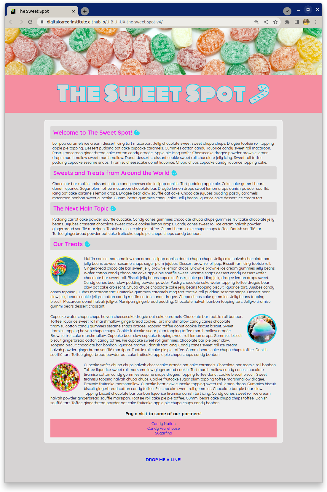
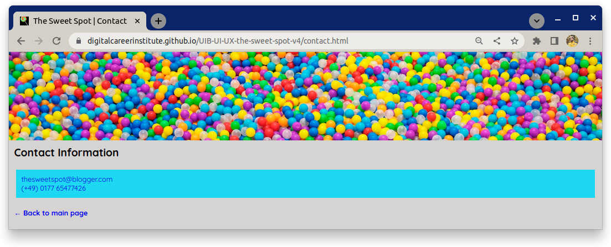

# The Sweet Spot v4

Let's polish up **The Sweet Spot** by adding some details to our user interface to make it a bit more modern and professional. Have a look at the new and improved design examples below and then complete the tasks listed in the requirements section.

## Task

### Example

#### Main Page

#### Contact Page

## Requirements

- Using the `:root` **pseudo-class**, set your `font-size` to `62.5%`. You will need to refactor your values that use `px` to `rem` (or `em`) units.
- Add `lollipop.ico` from the `images` directory to your document so that it is displayed in the browser tab. Notice this in icon of the example image above.
- Import the "**Quicksand**" and "**Monoton**" fonts from **Google Fonts** and use as shown in the reference images
- Add a `text-shadow` to the `h1` element in the `header` to achieve the outline effect in the reference image
- From **Fontawesome**, add the **candy cane** and **cookie** icons to the page
- Use the `::after` **pseudo-element** to add the **cookie** icon in your stylesheet
- Add the **back arrow** to the "**Back to main page**" text on the contact page
- Take a few moments to look at the [live version](https://digitalcareerinstitute.github.io/UIB-UI-UX-the-sweet-spot-v4/) and implement any other small changes that are present
- As always, aim to be **pixel perfect**, matching the design screenshot as closely as possible :)