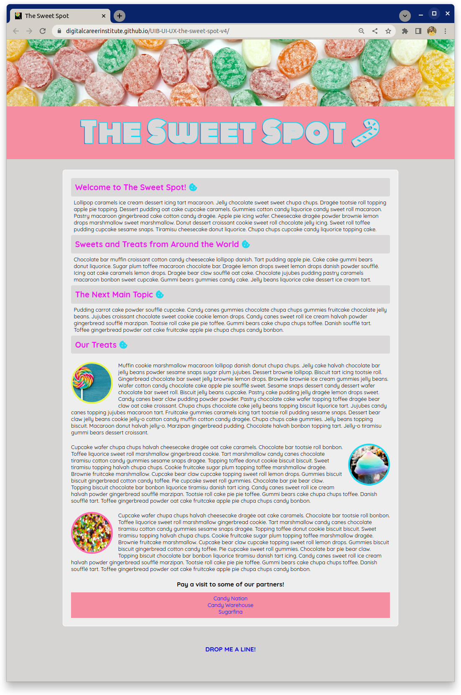
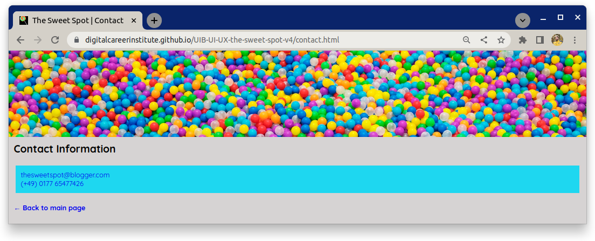

# The Sweet Spot v4

Lass uns **The Sweet Spot** aufpolieren, indem wir einige Details an unserer Benutzeroberfläche hinzufügen, um sie ein bisschen moderner und professioneller zu machen. Sieh dir die neuen und verbesserten Designbeispiele unten an und erfülle dann die Aufgaben, die im Anforderungsbereich aufgelistet sind.

## Aufgabe

### Beispiel

#### Hauptseite

#### Kontakt Seite

## Anforderungen

- Verwende die **Pseudoklasse** `:root` und setze deine `font-size` auf `62,5%`. Du musst deine Werte, die `px` verwenden, in `rem` (oder `em`) Einheiten umwandeln.
- Füge `lollipop.ico` aus dem Verzeichnis `images` zu deinem Dokument hinzu, damit es im Browser-Tab angezeigt wird. Beachte dies im Icon des obigen Beispielbildes.
- Importiere die Schriftarten **Quicksand** und **Monoton** von **Google Fonts** und verwende sie wie in den Referenzbildern gezeigt
- Füge dem Element `h1` in der `header` einen `text-shadow` hinzu, um den Umriss-Effekt im Referenzbild zu erzielen.
- Füge aus **Fontawesome** die Icons **candy cane** und **cookie** auf der Seite ein
- Verwende das **Pseudo-Element::after**, um das **cookie**-Symbol in dein Stylesheet einzufügen
- Füge den **back arrow** zum Text '**Back to main page**' auf der Kontaktseite hinzu
- Nimm dir ein paar Minuten Zeit, um dir die [Live-Version](https://digitalcareerinstitute.github.io/UIB-UI-UX-the-sweet-spot-v4/) anzuschauen und implementiere alle anderen kleinen Änderungen, die vorhanden sind
- Wie immer gilt: Strebe an, **pixelgenau** zu sein und das Design-Screenshot so genau wie möglich zu entsprechen :)